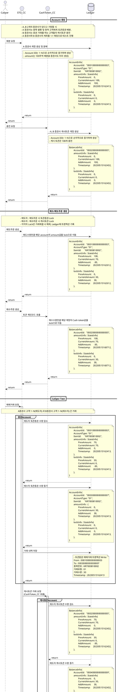

```plantuml
@startuml test
actor Caliper
entity STO_CC 
entity CashToken_CC
database Ledger


== Account 생성==
note over Caliper, Ledger 
- A, B 2개의 증권사가 있다고 가정할 시
- A 증권사는 종목 발행 및 청약 고객에게 토큰증권 배분,
- B 증권사는 증권 거래를 하는 고객들의 캐시토큰 충전
- A 증권사와 B 증권사의 계좌를 1:1 매칭으로 테스트 진행
end note
Caliper-> STO_CC : 배분 요청

STO_CC -> Ledger: A 증권사 계정 생성 및 분배
note right of STO_CC 
- Account ID는 1~N으로 순차적으로 증가하며 생성
- amount는 100주씩 배분(B 증권사도 미리 생성)
end note

note over of Ledger 
AccountInfo{
	AccountId:   "00010000000000003",
	AccountType: "01",
	ItemId:      "KR7000810002",
	amountInfo : StateInfo{
		PrevAmount:    0,
		CurrentAmount: 100,
		AddAmount:     100,
		Timestamp:     20230515162413,
	},
	lockInfo : StateInfo{
		PrevAmount:    0,
		CurrentAmount: 0,
		AddAmount:     0,
		Timestamp:     20230515162413,
	},
}
end note


Ledger--> STO_CC : return
STO_CC --> Caliper: return

Caliper-> CashToken_CC: 충전 요청
CashToken_CC-> Ledger: - A, B 증권사 캐시토큰 계정 생성
note right of CashToken_CC
- Account ID는 1~N으로 순차적으로 증가하며 생성
- 캐시 토큰은 100개 충전
end note

note over of Ledger
BalanceInfo{
	AccountId:   "00020000000000005",
	amountInfo : StateInfo{
		PrevAmount:    0,
		CurrentAmount: 100,
		AddAmount:     100,
		Timestamp:     20230515162432,
	},
	lockInfo : StateInfo{
		PrevAmount:    0,
		CurrentAmount: 0,
		AddAmount:     0,
		Timestamp:     20230515162432,
	},
}
end note
Ledger--> CashToken_CC: return 
CashToken_CC--> Caliper: return

|||


== 매수/매도주문 생성==
note over Caliper, Ledger
- 매도자 : 매도주문 시 토큰증권 Lock
- 매수자 : 매수주문 시 캐시토큰 Lock 
- 각각의 Lock은 거래체결 시 해제, Ledger에 트랜잭션 기록
end note


Caliper-> STO_CC : 매도주문 생성

STO_CC -> Ledger: 매도수량만큼 해당 account의 amount값을 lock으로 이동
note over of Ledger 
AccountInfo{
	AccountId:   "00010000000000003",
	AccountType: "01",
	ItemId:      "KR7000810002",
	amountInfo : StateInfo{
		PrevAmount:    100,
		CurrentAmount: 70,
		AddAmount:     -30,
		Timestamp:     20230515162612,
	},
	lockInfo : StateInfo{
		PrevAmount:    0,
		CurrentAmount: 30,
		AddAmount:     30,
		Timestamp:     20230515162612,
	},
}
end note
Ledger --> STO_CC: return
STO_CC --> Caliper: return
|||
Caliper-> STO_CC : 매수주문 생성
STO_CC-> CashToken_CC : 토큰 체인코드 호출
CashToken_CC -> Ledger: 매수수량만큼 해당 계정의 Cash token값을\nlock으로 이동
note over of Ledger 
BalanceInfo{
	AccountId:   "00020000000000005",
	amountInfo : StateInfo{
		PrevAmount:    100,
		CurrentAmount: 70,
		AddAmount:     -30,
		Timestamp:     20230515168712,
	},
	lockInfo : StateInfo{
		PrevAmount:    0,
		CurrentAmount: 30,
		AddAmount:     30,
		Timestamp:     20230515168712,
	},
}
end note
Ledger --> CashToken_CC: return
CashToken_CC --> STO_CC: return
STO_CC --> Caliper: return
|||
== Caliper Test==

Caliper-> STO_CC : 매매거래 요청

note over Caliper, Ledger 
A증권사 고객 1~N(매도자) 과 B증권사 고객 1~N(매수자) 간 거래
end note

activate STO_CC 
group 증권Account
STO_CC -> Ledger: 매도자 토큰증권 수량 감소
note over of Ledger 
AccountInfo{
	AccountId:   "00010000000000003",
	AccountType: "01",
	ItemId:      "KR7000810002",
	amountInfo : StateInfo{
		PrevAmount:    70,
		CurrentAmount: 70,
		AddAmount:     0,
		Timestamp:     20230515162413,
	},
	lockInfo : StateInfo{
		PrevAmount:    30,
		CurrentAmount: 0,
		AddAmount:     -30,
		Timestamp:     20230515162413,
	},
}
end note
Ledger--> STO_CC : return
STO_CC -> Ledger : 매수자 토큰증권 수량 증가
note over of Ledger 
AccountInfo{
	AccountId:   "00030000000000007",
	AccountType: "01",
	ItemId:      "KR7000810002",
	amountInfo : {
		PrevAmount:    0,
		CurrentAmount: 30,
		AddAmount:     30,
		Timestamp:     20230515162413,
	},
	lockInfo : StateInfo{
		PrevAmount:    0,
		CurrentAmount: 0,
		AddAmount:     0,
		Timestamp:     20230515162413,
	},
}
end note
Ledger--> STO_CC : return
STO_CC -> Ledger: 거래 내역 저장

note over of Ledger
- 토큰증권 매매거래 트랜잭션 Write
From : 00010000000000003 
To : 00030000000000007 
종목번호 : KR7000810002 
거래유형 : 01 
거래수량 : 30
Timestamp : 20230515162413
end note

Ledger--> STO_CC : return

end

|||

STO_CC -> CashToken_CC: 캐시토큰 거래 요청\n(CashToken_CC 호출)

activate CashToken_CC

group 캐시토큰Account
CashToken_CC-> Ledger: 매수자 캐시토큰 수량 감소
note over of Ledger
BalanceInfo{
	AccountId:   "00020000000000005",
	amountInfo : StateInfo{
		PrevAmount:    70,
		CurrentAmount: 70,
		AddAmount:     0,
		Timestamp:     20230515162432,
	},
	lockInfo : StateInfo{
		PrevAmount:    30,
		CurrentAmount: 0,
		AddAmount:     -30,
		Timestamp:     20230515162432,
	},
}
end note
Ledger--> CashToken_CC: return

CashToken_CC--> Ledger: 매도자 캐시토큰 수량 증가
note over of Ledger
BalanceInfo{
	AccountId:   "00040000000000009",
	amountInfo : StateInfo{
		PrevAmount:    0,
		CurrentAmount: 30,
		AddAmount:     30,
		Timestamp:     20230515162432,
	},
	lockInfo : StateInfo{
		PrevAmount:    0,
		CurrentAmount: 0,
		AddAmount:     0,
		Timestamp:     20230515162432,
	},
}
end note
Ledger--> CashToken_CC: return
CashToken_CC-> Ledger: 전송 내역 저장

note over of Ledger
- 캐시토큰 전송 트랜잭션 Write
From : 00020000000000005
To : 00040000000000009
거래수량 : 30 
Timestamp : 20230515162432 
end note


Ledger--> CashToken_CC: return
end

CashToken_CC--> STO_CC : return


deactivate CashToken_CC
STO_CC --> Caliper: return
deactivate STO_CC 
|||

@enduml
```
